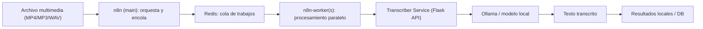

# Agente de Transcripción de Archivos Multimedia
Caso de uso — Proyecto de grado: implementación de agentes de IA con LLMs locales en entornos seguros.

## 🧩 Descripción general

Este repositorio implementa un agente local para transcripción automática de archivos multimedia (audio o video), diseñado para operar en entornos institucionales sin dependencia de servicios en la nube.

La arquitectura actual usa ejecución en cola de n8n (queue mode) para soportar procesamiento concurrente más confiable.

## 🏗️ Componentes principales

| Componente | Función | Tecnología |
| --- | --- | --- |
| **n8n (main)** | Orquestación de flujos, UI y encolado de ejecuciones. | [n8n.io](https://n8n.io) |
| **n8n-worker** | Procesa trabajos en paralelo desde la cola de n8n. | [n8n.io](https://n8n.io) |
| **Redis** | Backend de cola para ejecuciones en modo `queue`. | Redis |
| **PostgreSQL** | Base de datos de n8n para estado y ejecuciones. | PostgreSQL |
| **Transcriber Service** | API REST local para transcribir audio/video. | Python + Flask |
| **Ollama** | Entorno local para modelos de IA. | [Ollama](https://ollama.ai) |

## ⚙️ Cambios recientes en infraestructura

- n8n configurado con `EXECUTIONS_MODE=queue`.
- Se agregó `n8n-worker` con concurrencia (`worker --concurrency=5`).
- Se incorporaron `redis` y `postgres` como dependencias del orquestador.
- Se agregaron healthchecks para `postgres` y `redis`.
- `depends_on` usa condiciones de salud (`service_healthy`) para mejorar el arranque.

## 🧰 Requisitos previos

- Docker y Docker Compose instalados.
- Al menos 8 GB de RAM (recomendado 16 GB para videos largos).
- Modelo local requerido (si aplica en tu flujo):

```bash
ollama pull whisper
```

## 🚀 Instalación nueva (primera vez en un equipo)

1. Clonar el repositorio:

```bash
git clone https://github.com/<usuario>/agent-transcripcion-local.git
cd agent-transcripcion-local
```

2. Crear `.env` en la raíz del proyecto.

Ejemplo mínimo recomendado:

```env
N8N_ENCRYPTION_KEY=replace-with-a-random-secret
POSTGRES_USER=n8n
POSTGRES_PASSWORD=change-me
POSTGRES_DB=n8n
```

3. Generar una llave segura para `N8N_ENCRYPTION_KEY`:

```bash
openssl rand -base64 24
```

4. Iniciar servicios:

```bash
docker compose up -d
```

5. Acceder a n8n:

```text
http://localhost:5678
```

## ♻️ Instalación existente / migración

Si ya existe información persistida de n8n (`n8n_data` y/o base de datos previa), **debes conservar la misma llave** `N8N_ENCRYPTION_KEY`.

Si aparece el error de "Mismatching encryption keys", usa el valor existente en:

```text
n8n_data/config
```

Campo:

```json
{
  "encryptionKey": "..."
}
```

Y colócalo en `.env` como `N8N_ENCRYPTION_KEY=...`.

## 🧠 Flujo de trabajo en n8n

URL local:

```text
http://localhost:5678
```

Flujo base sugerido:

| Paso | Nodo | Descripción |
| --- | --- | --- |
| 1 | **Webhook / File Upload** | Recibe el archivo multimedia. |
| 2 | **HTTP Request** | Envía el archivo a `http://transcriber:5000/transcribe` (red interna Docker). |
| 3 | **Set / Function** | Extrae el texto de la respuesta (`response`). |
| 4 | **Write File / DB / Email** | Persiste o distribuye la transcripción. |

## 🧪 Prueba directa del microservicio

```bash
curl -X POST http://localhost:5000/transcribe \
  -F "file=@uploads/clase1.mp3"
```

Salida esperada (ejemplo):

```json
{
  "response": "Bienvenidos a la clase de hoy sobre inteligencia artificial aplicada a la educación..."
}
```

## 🔁 Escalar procesamiento paralelo

Para más capacidad de ejecución concurrente:

```bash
docker compose up -d --scale n8n-worker=3
```

## 🧱 Estructura del proyecto

```text
agent-transcripcion-local/
├── docker-compose.yml
├── .env
├── transcriber/
│   ├── Dockerfile
│   ├── requirements.txt
│   └── app.py
├── n8n_data/
├── uploads/
├── resultados/
└── README.md
```

## 🔐 Consideraciones de privacidad y seguridad

- Todo el procesamiento ocurre localmente, sin enviar archivos a terceros por defecto.
- Audio/video y resultados se mantienen en rutas locales del entorno.
- No subas tu `.env` al repositorio (incluye secretos).
- Mantén fija la `N8N_ENCRYPTION_KEY` por entorno para evitar pérdida de acceso a credenciales cifradas.

## 📚 Referencias técnicas

- [n8n docs](https://docs.n8n.io/)
- [n8n queue mode](https://docs.n8n.io/hosting/scaling/queue-mode/)
- [Ollama](https://ollama.ai)
- [Docker Compose](https://docs.docker.com/compose/)

## ⚙️ Arquitectura del agente


